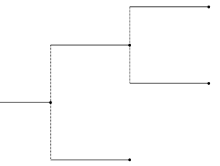
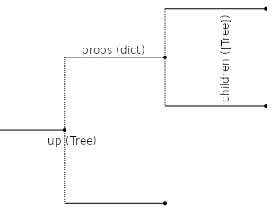
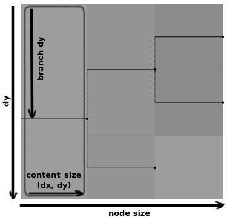
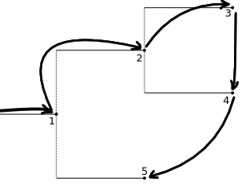
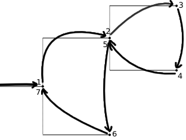

.. currentmodule:: ete4

Essentials
==========

Tree Representation
-------------------

In general, a *tree* is `a set of linked nodes
<https://en.wikipedia.org/wiki/Tree_(data_structure)>`_ that simulates
a hierarchical `tree structure
<https://en.wikipedia.org/wiki/Tree_structure>`_.

The trees we are interested in are `phylogenetic trees
<https://en.wikipedia.org/wiki/Phylogenetic_tree>`_, which show the
relationships among various biological species. Every node can have a
*name* and other *node properties*, and is connected to other nodes by
branches with some *length* that measures in some form the
evolutionary distance between the nodes, and other *branch
properties*.

In the representation that we have chosen, a :class:`Tree` is a
structure with some content (internally stored in a dictionary
``props`` of properties) and a list of ``children``, which can be
viewed as trees themselves. It can have a parent (``up``), which is
the tree that has it as a child.

(This representation is quite straightforward and is based on how
phylogenetic trees are normally described as `newicks
<https://en.wikipedia.org/wiki/Newick_format>`_. But it has some
drawbacks: the concepts of *node* and *tree* are blurred together, the
*branch* is considered somehow part of the node (which is possible
since there is only one branch per node linking to its parent), and
there is no clear distinction between *node properties* and *branch
properties*. Other representations may be more appropriate.)

Size
----

A :class:`Tree` also has a ``size``, which is a tuple ``(dx, dy)``
formed by the distance to its further leaf (including its own length),
and the total number of descendant leaves.

This concept is exploited when drawing with different representations,
as it will help discover when a node (including its descendants) is
visible in the current viewport.

We distinguish between this size, also called ``node_size``, and the
size occupied only by the contents of the node itself, which we call
``content_size``.

Both sizes have the same ``dy``, since the number of descendant leaves
is the same. They differ in their ``dx``, which is just the node's
length (distance) for ``content_size``. Since we can easily compute
``content_size``, it is not stored separately in the tree itself.

Finally, there is another distance that becomes relevant for the
description of the node when drawing: its *branch dy* (``bdy``). It is
the distance from the top of the node to the branch, which is computed
so it is halfway between the line that encompasses all of its
children.

Traversal
---------

We can traverse all the nodes of a tree by using the tree ``traverse``
function to get an iterator.

The following code would visit the different nodes in preorder::

  for node in tree.traverse():
      ... # do things with node

There is a more versatile way of traversing the tree, which is very
useful for drawing: ``walk(tree)``. Its name comes from the standard
library function ``os.walk``, which traverses a directory tree.

It visits all internal nodes twice: when they appear first in
preorder, and after having visited all their descendants. It provides
an iterator `it` that can be manipulated to stop visiting the
descendants of a node (by setting ``it.descend = False``). The
iterator also provides the current node (``it.node``), says if it is
the first time that the node is being visited (``it.first_visit``),
and can give an id that identifies the position of the node within the
original tree (``it.node_id``).

::

  import operations as ops

  for it in ops.walk(tree):
      ... # do things with  it.node
      ... # possibly depending on  it.first_visit
      ... # maybe using  it.node_id  too
      ... # and maybe set  it.descend = False  to skip its children

node_id
~~~~~~~

The ``node_id`` is a tuple that looks like ``(0, 1, 0)`` for the node
that comes from the root's 1st child, then its 2nd child, and then its
1st child.

A tree can be used as a list to access directly one of its nodes. The
syntax ``tree[name]``, where ``name`` is a string, will return the
first node whose name matches the given one. And ``tree[node_id]``,
where `node_id` is a tuple as described before, will return the
corresponding node at that position.

.. image:: ../images/node_id.png

The syntax is composable, in the sense::

  tree[0,1,0] == tree[0][1,0] \
              == tree[0,1][0] \
              == tree[0][1][0] \
              == tree[][0][1][0]

This simplifies working with subtrees, since they can be treated as
independent trees and are easily recovered from the original tree at
any moment.
