.. currentmodule:: ete4.smartview

Tree drawing and exploration (web)
==================================

.. contents::

Overview
--------

We can represent and interact with a tree in a flexible way by using
the *explorer* module.

Let's create a simple tree with 100 leaves and randomly populated::

  from random import random
  from ete4 import Tree
  t = Tree()
  t.populate(100, dist_fn=random, support_fn=random)

We can start exploring it with::

  t.explore()

At that moment the web browser will open, and we can use the graphical
user interface (GUI) to interact with our tree using the default
visualization.

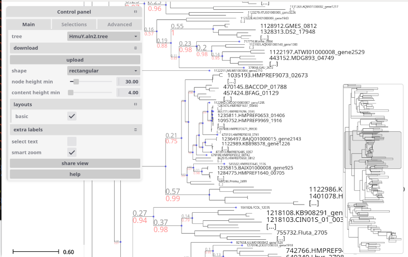

There are already many things that can be done to change the
visualization by using the menus in the GUI and changing styles, doing
searches, creating labels and more.

But we can also control programatically how to do the visualization,
and in a more flexible way. We do that by using *layouts*.

With a layout we can for example set some style for the lines of the
tree, the dots of the nodes, and many other tree-related styles. Or
change the style of only some nodes that we are interested in. We may
want to add textual or graphical information to certain nodes too.

The concepts that ETE uses to describe the visualization are:

- **Styles** represented as dictionaries. For example ``{'shape':
  'circular', 'hz-line': {'stroke-width': 2}}``.
- **Faces**, pictorial or textual *information pieces* represented by
  the class :class:`Face <faces>`, with a variety of subclasses
  for different kinds of representations (:class:`TextFace
  <faces.TextFace>`, :class:`ImageFace <faces.ImageFace>`, ...). Faces
  know how to return graphic elements showing the information
  corresponding to a node, or to a group nodes collapsed together.
- **Decorations**, a way to describe where to place faces, by means of
  the class :class:`Decoration <layout.Decoration>`. It mainly allows
  to specify the ``position`` where to draw the information relative
  to its node (on *top* of its branch, at its *right*, *aligned*,
  etc.), and in which column to put it (to stack it nicely with other
  faces from the same layout or a different one).
- **Layouts**, full descriptions of how to represent a tree, using the
  class :class:`Layout <layout.Layout>`. They contain a
  :func:`draw_node()` function that produces the decorations and
  styles that we want for a given node, and a :func:`draw_tree()`
  function that does the same for the full tree. They
  exploring/visualizing a tree, they compose: using several layouts
  will add extra graphic representations, and/or overwrite some styles
  from previous layouts.

Launching the explorer
----------------------

To start the visualization of a tree, we can use the :func:`explore
<ete4.Tree.explore>` method as shown above::

  t.explore(...)

If we run it from the python console, in addition to opening a web
browser session, the call returns immediately and we can continue
working with the tree in the console.

The explorer allows to visualize and also manipulate the tree. You can
in parallel change the tree from the GUI and from the console, and the
changes will be reflected everywhere.

This is very useful, but sometimes we want a different behavior. Let's
see some examples of typical uses.

Standalone scripts
~~~~~~~~~~~~~~~~~~

If we run a standalone script, after the call to :func:`explore
<ete4.Tree.explore>` the program will continue and probably end,
finishing the interactive session at the same time.

We can set the argument ``keep_server=True`` to keep the server running::

  t.explore(keep_server=True)

The program will run until we kill the process (with Ctrl+C for
example).

A better way is to simply wait for some input before continuing, for
example::

  t.explore()
  print('Press enter to stop the server and finish.')
  input()

Verbose mode
~~~~~~~~~~~~

We can set ``verbose=True`` to see all the actions made by the ETE
backend, which can be useful for debugging and for getting an insight
on how the explorer works::

  >>> t.explore(verbose=True)
  Explorer now available at http://127.0.0.1:5000
  127.0.0.1 - - [18/Dec/2024 10:41:39] "GET / HTTP/1.1" 303 0
  127.0.0.1 - - [18/Dec/2024 10:41:39] "GET /static/gui.html?tree=tree-1 HTTP/1.1" 200 1476
  127.0.0.1 - - [18/Dec/2024 10:41:39] "GET /static/gui.css HTTP/1.1" 200 5255
  [...]
  127.0.0.1 - - [18/Dec/2024 10:41:39] "GET /trees HTTP/1.1" 200 36
  127.0.0.1 - - [18/Dec/2024 10:41:39] "GET /static/icon.png HTTP/1.1" 200 686
  127.0.0.1 - - [18/Dec/2024 10:41:39] "GET /trees/tree-1/layouts HTTP/1.1" 200 27
  [...]
  127.0.0.1 - - [18/Dec/2024 10:41:39] "GET /trees/tree-1/draw?shape=rectangular&node_height_min=30&content_height_min=4&zx=375.9&zy=178.79999999999998&x=-0.33333333333333337&y=-0.16666666666666669&w=3.3333333333333335&h=3.3333333333333335&collapsed_shape=skeleton&collapsed_ids=%5B%5D&layouts=%5B%22basic%22%5D&labels=%5B%5D HTTP/1.1" 200 1331

Basic layout (leaf names, branch length and support)
~~~~~~~~~~~~~~~~~~~~~~~~~~~~~~~~~~~~~~~~~~~~~~~~~~~~

When we call ``t.explore()`` without any arguments, a layout is
automatically added to show the names of the leaf nodes, the branch
lengths and their support (the ``BASIC_LAYOUT``).

We can remove it from the GUI by clicking on it in the menu *layouts*,
or programatically by specifying an empty list of layouts::

  t.explore(layouts=[])

So what happens when we are not explicitely passing the `layouts`
argument? The explorer interprets it as::

  from ete4.smartview import BASIC_LAYOUT
  t.explore(layouts=[BASIC_LAYOUT])

Showing node's properties in a popup
~~~~~~~~~~~~~~~~~~~~~~~~~~~~~~~~~~~~

When we hover with the mouse over a node, we can see its properties in
a popup. By default, only the name, the length, and the support appear
(if they are defined).

By setting the arguments ``show_popup_props`` and ``hide_popup_props`` we
can choose which properties to show. This way the backend only needs
to send the relevant information when drawing the nodes, and we can
visualize only what we want without being overwhelmed.

For example, to show only the property ``dist``::

  t.explore(show_popup_props=['dist'])

Or if we want to see all except some::

  t.explore(show_popup_props=None, hide_popup_props=['dist', 'sequence'])

Control panel
~~~~~~~~~~~~~

When exploring the tree, a control panel will be shown in the left
side of the tree panel.

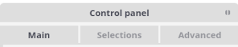

It consists of the three major tabs:

- **Main**: More common settings including layouts, collapsing level, etc.
- **Selections**: For searches, manual collapse and tagging of nodes.
- **Advanced**: With less common settings and operations like sorting, changing styles, etc.

1) Main
^^^^^^^

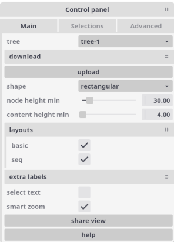

This tab contains the general settings of the tree visualization. It
includes among other things:

- **tree**: Selector with current tree (can select other loaded trees).
- **download**: Different ways to download the tree (as newick or as an image).
- **upload**: Allows to upload new trees from their newick representation.
- **shape**: Tree representation as ``rectangular`` or ``circular``.
- **node height min**: Minimum height in pixels to expand a node (otherwise shown as collapsed).
- **content height min**: Minimum height in pixels to show content (content with less height will not show).
- **layouts**: Lists all available layouts and allows to switch them on and off.
- **extra labels**: Allows to add labels, additional pieces of information to attach to nodes.
- **smart zoom**: Zooms making the current node under the cursor grow towards the window.

2) Selections
^^^^^^^^^^^^^

.. image:: ../images/panel_selections.png

This tab contains the searches and selected nodes.

We can make a search with clicking *new search* button (also the "/"
shortcut), then input the query in the search box. There are different
ways to search for nodes.

Simple search
"""""""""""""

We can put a text in the search box to find all the nodes whose name
matches it. The search will be case-insensitive if the text is all in
lower case, and case-sensitive otherwise.

Regular expression search
"""""""""""""""""""""""""

To search for names mathing a given regular expression, we can prefix
the text with the command ``/r`` (the *regexp command*) and follow it
with the regular expression.

Expression search
"""""""""""""""""

When prefixing our text with ``/e`` (the *eval command*), we can use a
quite general python expression to search for nodes. This is the most
powerful search method available (and the most complex to use).

The expression will be evaluated for every node, and will select those
that satisfy it. In the expression we can use (among others) the
following variables, with their straightforward interpretation:
``node``, ``parent``, ``is_leaf``, ``length`` / ``dist`` / ``d``, ``properties`` /
``p``, ``children`` / ``ch``, ``size``, ``dx``, ``dy``, ``regex``.

Topological search
""""""""""""""""""

Similar to the expression search, if we prefix the text with ``/t`` (the
*topological command*), we can write a newick tree with quoted names
in each node containing an eval command. This will select the nodes
that satisfy the full subtree of expressions that you passed.

Examples
""""""""

Some examples of searches and possible matches:

+----------------------------------------+-------------------------------------------------------+
| Query                                  | Example match                                         |
+========================================+=======================================================+
| ``citrobacter``                        | will match nodes named "Citrobacter werkmanii" and    |
|                                        | "Citrobacter youngae"                                 |
+----------------------------------------+-------------------------------------------------------+
| ``UBA``                                | will match "spx UBA2009" but not "Rokubacteriales"    |
+----------------------------------------+-------------------------------------------------------+
| ``/r sp\d\d``                          | will match any name that contains "sp" followed by    |
|                                        | (at least) two digits, like "Escherichia sp002965065" |
|                                        | and "Citrobacter sp005281345"                         |
+----------------------------------------+-------------------------------------------------------+
| ``/e len(ch) > 2``                     | will match nodes with more than 2 children            |
+----------------------------------------+-------------------------------------------------------+
| ``/e is_leaf and``                     | will match leaf nodes with property "species"         |
| ``p['species'] == 'Homo'``             | equal to "Homo"                                       |
+----------------------------------------+-------------------------------------------------------+
| ``/t ("is_leaf","d > 1")"name=='AB'"`` | will match nodes named "AB" that have                 |
|                                        | two children, one that is a leaf and                  |
|                                        | another that has a length > 1                         |
+----------------------------------------+-------------------------------------------------------+

3) Advanced
^^^^^^^^^^^

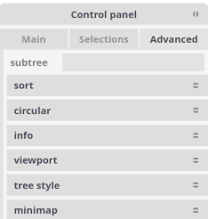

This tab contains functions to select subtrees, sort, change styles
and more.

Context menu
~~~~~~~~~~~~

We can right-click on a node to open a context menu with different
options.

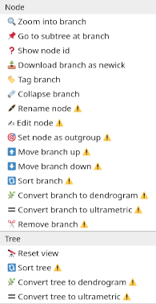

There are many node-specific actions such as renaming, collapsing,
moving and more. And there are a few tree actions like reseting the
view, sorting the tree, or converting it to dendogram or ultrametric.

Customizing the visualization
-----------------------------

The main elements used to customize the visualization are *styles*,
*faces*, *decorations*, and *layouts*.

Layouts
~~~~~~~

Layouts contain the ``draw_node()`` and ``draw_tree()`` functions, which
create the styles and faces that we use to represent the tree. They
are objects of the class :class:`Layout <layout.Layout>`. They contain:

- ``name``: Identifies the layout, so it can be activated/deactivated in the GUI.
- ``draw_tree()``: A function that sets style and decorations for the full tree.
- ``draw_node()``: A function that sets style and decorations for the given nodes.
- ``cache_size``: The number of arguments cached when calling `draw_node` (defaults to all).
- ``active``: Whether the layout will be immediately active when exploring (defaults to True).

Let's look at how to use them. The simplest case is::

  from ete4 import Tree
  from ete4.smartview import Layout

  t = Tree()
  t.populate(20)

  layout = Layout(name='I am a layout doing nothing')

  t.explore(layouts=[layout])

We can see a representation of the tree, and in the control panel, a
layout that appears with the name "I am a layout doing nothing".

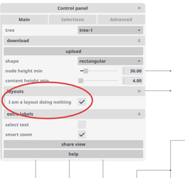

It name is accurate, as we can see if we activate or desactivate it by
clicking its checkbox: nothing happens, no extra information is shown
in the tree anyway.

Changing the tree style
~~~~~~~~~~~~~~~~~~~~~~~

The ``draw_tree`` field of a layout specifies the general aspects of the
tree style. For example, we can modify the scale used to render tree
branches or choose between circular or rectangular tree drawing, etc.

In general, it is a function of the tree, and returns a list of
decorations and styles to use.

We often just need to change its style, and in a way that does not
depend on the tree. For that common case, ``draw_tree`` can also be a
dictionary with the style.

A dictionary with the tree style can look like this::

  my_tree_style = {
     'shape': 'circular',  # or 'rectangular'
     'radius': 5,  # in circular mode, minimum radius value
     'angle-start': -pi/2,  # in circular mode, where to start
     'angle-end': pi/2,  # alternatively we can give 'angle-span'
     'node-height-min': 10,  # when to start collapsing nodes
     'content-height-min': 5,  # when to start showing faces
     'collapsed': {'shape': 'outline', 'fill-opacity': 0.8},
     'show-popup-props': None,  # show all defined properties
     'hide-popup-props': ['support'],  # except support
     'is-leaf-fn': lambda node: node.level > 4,  # nodes treated as leaves
     'box': {'fill': 'green', 'opacity': 0.1, 'stroke': 'blue'},
     'dot': {'shape': 'hexagon', 'fill': 'red'},
     'hz-line': {'stroke-width': 2},  # horizontal line to parent
     'vt-line': {'stroke': '#ffff00'},  # vertical line to children
  }

The last four (**box**, **dot**, **hz-line**, **vt-line**) define the
general look for all the nodes, but they can be overriden too in an
individual basis with the function ``draw_node`` as explained below.

The :class:`Layout <layout>` documentation has a complete list of options.

Let's see some examples of how to modify the tree style.

Example of simple change
^^^^^^^^^^^^^^^^^^^^^^^^

A simple way to control the tree style is to pass a dictionary with
the options we want to ``draw_tree``::

  from ete4 import Tree
  from ete4.smartview import Layout

  t = Tree()
  t.populate(20)

  layout = Layout(name='my layout',
                  draw_tree={'node-height-min': 100})

  t.explore(layouts=[layout])

In this case, we are requesting to collapse any node with a height
less than 100 pixels.

.. TODO: Add LegendFace, maybe, and have draw.js put Decoration(...,
   position='top') or 'top-right', etc, put things in that place.
   Then, add an example as in the old tutorial. Something like:
     legend = LegendFace(title='My legend', variable='discrete',
                         colormap={'a': 'red', 'b': 'blue', 'c': 'green'})
     yield Decoration(legend, position='top-right')

Changing the node style
~~~~~~~~~~~~~~~~~~~~~~~

In the same way that we can control the general tree style with a
dictionary of options returned by ``draw_tree``, we can also control the
style of a given node with a dictionary of options returned by
``draw_node``.

It is possible to change the color, thickness of lines and many more
style attributes of the following node elements:

- **box**: The box (area) surrounding the node.
- **dot**: The dot that represents the node itself.
- **hz-line**: The horizontal line that connects it to its parent.
- **vt-line**: The vertical line connecting it to its children.

For all of them there are many options to change their style. The main
options are **fill**, **stroke**, **stroke-width**, **opacity**, but
there are also many more: **fill-opacity**, **stroke-opacity**,
**stroke-linecap**, **stroke-linejoin**, **stroke-miterlimit**,
**stroke-dashoffset**, **stroke-dasharray**, **paint-order**,
**fill-rule**, etc. They are all based on `SVG attributes
<https://developer.mozilla.org/en-US/docs/Web/SVG/Tutorial/Fills_and_Strokes>`_.

In addition to those, some elements have extra attributes:

- **dot**

  - **shape**: Figure (circle, square, ...) or its number of sides, representing the node.
  - **radius**: The approximate radius in pixels of the dot.

- **collapsed** (only used from the tree style)

  - **shape**: Representation of collapsed nodes as "skeleton" or "outline".

Example of simple change
^^^^^^^^^^^^^^^^^^^^^^^^

A simple tree where we change the style for the leaves::

  from ete4 import Tree
  from ete4.smartview import Layout

  t = Tree('((a,b),c);')

  # Nodes will be represented as small red triangles of 5 pixels radius.
  style_dot = {'shape': 'triangle',
               'radius': 10,
               'fill': 'red'}

  # Branch lines (horizontal lines) will be brown and dashed, and 10 pixels thick.
  style_hz_line = {'stroke-dasharray': '5,5',
                   'stroke-width': 10,
                   'stroke': '#964B00'}

  def draw_node(node):
      if node.is_leaf:
          return {'dot': style_dot,
                  'hz-line': style_hz_line}

  layout = Layout(name='My layout', draw_node=draw_node)
  t.explore(layouts=[layout])

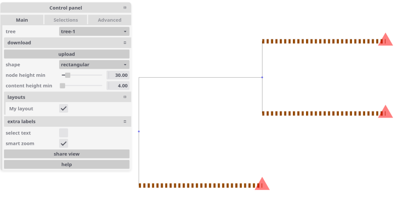

We can use different styles for different nodes. Let's see a couple of
examples::

  from ete4 import Tree
  from ete4.smartview import Layout

  t = Tree('((a,b),c);')

  # Leaves will have small red squares of radius 10 pixels.
  leaf_style = {'dot': {'shape': 'square',
                        'radius': 5,
                        'fill': 'red'}}

  # The root node will be blue, with a dot of 15 pixel radius, and a
  # custom vertical line.
  root_style = {'box': {'fill': 'blue'},
                'dot': {'radius': 15},
                'vt-line': {'stroke': '#964B00',
                            'stroke-width': 10,
                            'stroke-dasharray': '5,5'}}

  def draw_node(node):
      if node.is_leaf:
          return leaf_style
      elif node.is_root:
          return root_style

  layout = Layout(name='My layout', draw_node=draw_node)
  t.explore(layouts=[layout])

.. image:: ../images/draw_node.png

::

  from ete4 import Tree
  from ete4.smartview import Layout, BASIC_LAYOUT

  t = Tree('((((a,b),c),d),e);')

  vowels = {'a', 'e', 'i', 'o', 'u'}

  def draw_node(node):
      if node.is_leaf:
          if node.name in vowels:
              return {'dot': {'radius': 8},
                      'box': {'fill': 'red'}}

  layout = Layout(name='My layout', draw_node=draw_node)
  t.explore(layouts=[BASIC_LAYOUT, layout])

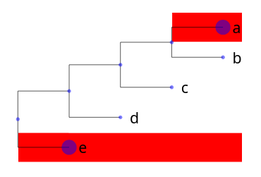

Faces and decorations
~~~~~~~~~~~~~~~~~~~~~

Faces are small pieces of graphical information that can be shown in
nodes. For instance, text labels or external images can be linked to
nodes and they will be plotted within the tree image.

Several types of node faces are provided by the
:mod:`ete4.smartview.faces` submodule, ranging from simple text
(:class:`TextFace <faces.TextFace>`) and geometric shapes
(:class:`CircleFace <faces.CircleFace>`) or (:class:`RectFace
<faces.RectFace>`), to molecular sequence representations
(:class:`SeqFace <faces.SeqFace>`).

A complete list of available faces can be found at the
:mod:`faces module page <ete4.smartview.faces>`.

Positioning faces with decorations
^^^^^^^^^^^^^^^^^^^^^^^^^^^^^^^^^^

Faces can be added to different areas around the node, namely
**right**, **left**, **top**, **bottom** or **aligned**. Each area
represents a table in which faces can be placed with a
:func:`Decoration <layout.Decoration>`.

For instance, if you want two text labels drawn below the branch line
of a given node, a pair of :class:`TextFace <face.TextFace>` faces can
be created and put into decorations for the columns 0 and 1 of the
**bottom** area, which are returned by the function ``draw_node``::

  from ete4 import Tree
  from ete4.smartview import Layout, Decoration, TextFace

  t = Tree('((a:1,b:1):1,c:1):1;')

  def draw_node(node):
      if node.is_root:
          return [Decoration(TextFace('hello', style={'fill': 'red'}),
                             column=0, position='bottom'),
                  Decoration(TextFace('world', style={'fill': 'blue'}),
                             column=1, position='bottom')]

  layout = Layout(name='My layout', draw_node=draw_node)
  t.explore(layouts=[layout])

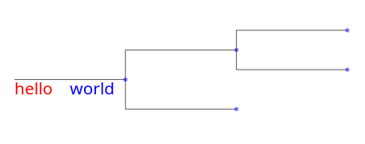

If we set the column of "world" to 0 too::

  from ete4 import Tree
  [...]
          return [Decoration(TextFace('hello', style={'fill': 'red'}),
                             column=0, position='bottom'),
                  Decoration(TextFace('world', style={'fill': 'blue'}),
                             column=0, position='bottom')]
  [...]
  t.explore(layouts=[layout])

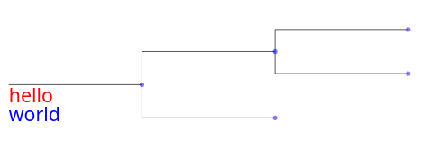

So if we add more than one face to the same area and column, they will
be piled up.

If the position is **aligned**, the face will be drawn in an aligned
column. Let's see an example::

  from ete4 import Tree
  from ete4.smartview import Layout, Decoration, TextFace

  t = Tree('((a,b),c);')

  def draw_node(node):
      if node.is_leaf:
          return [Decoration(TextFace('hello', style={'fill': 'red'}),
                             column=0, position='aligned'),
                  Decoration(TextFace('world', style={'fill': 'blue'}),
                             column=1, position='aligned')]

  layout = Layout(name='My layout', draw_node=draw_node)
  t.explore(layouts=[layout])

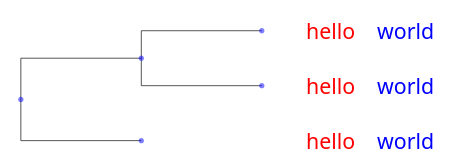

.. note::

  Once a face object is created, it can be used in one or more nodes.
  For instance, the same text label could be "recycled" and added to
  several nodes.

Collapsed nodes
^^^^^^^^^^^^^^^

When viewing a large tree, ETE will collapse all the branches that are
too small to be seen. When a branch is collapsed, we see a skeleton of
its contents by default (but the shape can be changed to a triangular
outline if we set it in the tree style, ``{'collapsed': {'shape':
'outline'}}``).

When drawing collapsed nodes, we see by default the faces that
correspond to all the sibling nodes that are collapsed together. But
we can fine-tune this behavior by passing a second argument to the
``draw_node`` function. This argument will contain a list of all the
collapsed (sibling) nodes at the time of the drawing, and it will be
empty if the node is not collapsed. The function will look like
``draw_node(node, collapsed)``::

  from ete4 import Tree
  from ete4.smartview import Layout, Decoration

  t = Tree('((a:1,b:1)n1:1,c):1;', parser='name')

  def draw_node(node, collapsed):
      if node.name == 'n1':
          if collapsed:
              return Decoration('n1 is collapsed', column=0, position='right')
          else:
              return Decoration('n1 is NOT collapsed', column=0, position='right')

  layout = Layout(name='My layout', draw_node=draw_node)
  t.explore(layouts=[layout])

Depending on the zoom level, we now will see:

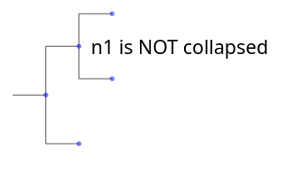
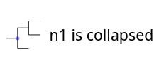

By the way, did you notice that we did not create a ``TextFace`` in
this case? If we pass a text to a ``Decoration`` instead of a face, it
will assume that we want a simple text face with that content.

.. TODO: See what the example of "all face positions" is about and update it.

.. Example of all face positions
.. https://github.com/dengzq1234/ete4_gallery/blob/master/smartview/faceposition_all.png?raw=true
.. source code can be found in in ETE4 here: `faceposition_all.py example <https://github.com/dengzq1234/ete4_gallery/blob/master/smartview/faceposition_all.py>`_.

.. End of that TODO.

Face properties
^^^^^^^^^^^^^^^

Each face has its own properties that control the details of its
drawing. We can find a complete list for each face in the
:class:`faces module documentation <faces>`.

Let's look at a simple example::

  from ete4 import Tree
  from ete4.smartview import Layout, TextFace

  t = Tree('((a:1,b:1):1,c:1):1;')

  # Create a TextFace initialized with certain properties.
  face_top = TextFace('branch top!',
                      fs_min=6, fs_max=25, rotation=-10,
                      style={'fill': 'blue', 'font-family': 'courier'})

  # Same thing, but adding them after initializing it.
  face_bottom = TextFace('branch bottom!')
  face_bottom.fs_min = 6
  face_bottom.fs_max = 25
  face_bottom.rotation = 10
  face_bottom.style = {'fill': 'red', 'font-family': 'sans-serif'}

  def draw_node(node):
      return [Decoration(face_top, position='top'),
              Decoration(face_bottom, position='bottom')]

  layout = Layout(name='My layout', draw_node=draw_node)
  t.explore(layouts=[layout])

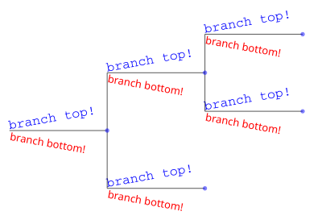

Combining styles and decorations
--------------------------------

The ``draw_node`` function can return a list with as many styles and
decorations as we want.

If it returns just one element (a decoration or a dictionary
representing a style), it is intepreted as a list of only one element
(itself).

Instead of returning a list, we can also `yield
<https://docs.python.org/3/reference/expressions.html#yieldexpr>`_
elements, that is, ``draw_node`` would become a `python generator
<https://peps.python.org/pep-0255/>`_. This syntax is the cleanest and
this way is the most efficient of all, so we will use it in the
following examples.

Let's see an example combining styles and faces, for both the tree
(with ``draw_tree``) and the nodes (with ``draw_node``)::

  from ete4 import Tree
  from ete4.smartview import Layout, TextFace

  t = Tree('((((a,b),c),d),e);')

  def draw_tree(tree):
      yield Decoration(TextFace('Vowel title', fs_min=5, fs_max=12),
                       position='header')
      #yield Decoration(LegendFace('My legend',
      #                            variable='discrete',
      #                            colormap={'vowel': 'red', 'conostant': 'blue'}))

  vowels = {'a', 'e', 'i', 'o', 'u'}

  def draw_node(node):
      if not node.is_leaf:
          return

      if node.name in vowels:
          yield {'dot': {'radius': 3},
                 'box': {'fill': 'red'}}
          yield Decoration(TextFace('vowel!', style={'fill': 'red'}),
                           position='aligned')
      else:
          yield {'dot': {'radius': 3},
                 'box': {'fill': 'blue'}}
          yield Decoration(TextFace('not vowel!', style={'fill': 'blue'}),
                           position='aligned')

  layout = Layout('My layout', draw_tree=draw_tree, draw_node=draw_node)
  t.explore(layouts=[layout])

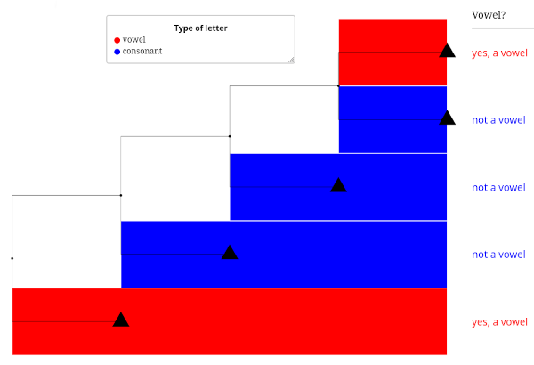

Let's see another example, where we change the background of certain
nodes that are common ancestors to other nodes we are interested in::

  from ete4 import Tree
  from ete4.smartview import Layout, Decoration, TextFace

  t = Tree('((((a1,a2),a3), ((b1,b2),(b3,b4))), ((c1,c2),c3));')

  # Background colors.
  style1 = {'box': {'fill': 'LightSteelBlue'}}
  style2 = {'box': {'fill': 'Moccasin'}}
  style3 = {'box': {'fill': 'DarkSeaGreen'}}
  style4 = {'box': {'fill': 'Khaki'}}

  # Find common ancestors.
  n1 = t.common_ancestor(['a1', 'a2', 'a3'])
  n2 = t.common_ancestor(['b1', 'b2', 'b3', 'b4'])
  n3 = t.common_ancestor(['c1', 'c2', 'c3'])
  n4 = t.common_ancestor(['b3', 'b4'])

  def draw_node(node):
      # Add node name with big text.
      yield Decoration(TextFace(node.name, fs_min=6, fs_max=25), position='right')

      # Set the node style.
      if node == n1:
          yield style1
      elif node == n2:
          yield style2
      elif node == n3:
          yield style3
      elif node == n4:
          yield style4

  layout = Layout('My layout', draw_node=draw_node)
  t.explore(layouts=[layout])

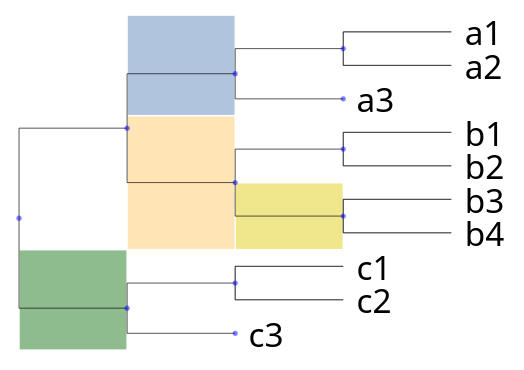

.. TODO: Add the equivalent of:
   # set color map dictionary
   colormap = {
      "ancestor_a": "LightSteelBlue",
      "ancestor_b": "Moccasin",
      "ancestor_c": "DarkSeaGreen",
      "ancestor_d": "Khaki"
   }
   def get_tree_style(colormap):
       def add_legend(tree_style):
           tree_style.add_legend(
               title = "MyLegend",
               variable = "discrete",
               colormap = colormap)
       return add_legend

.. TODO: Add the examples from the old documentation, updated to use
   the new way of doing things. The sections that are missing are:
   Color Strip, Outlined Collapsed Clade, Bar Plot, Heatmap, Visualize
   Multiple Sequence Alignment and Domain, Domain annotation
